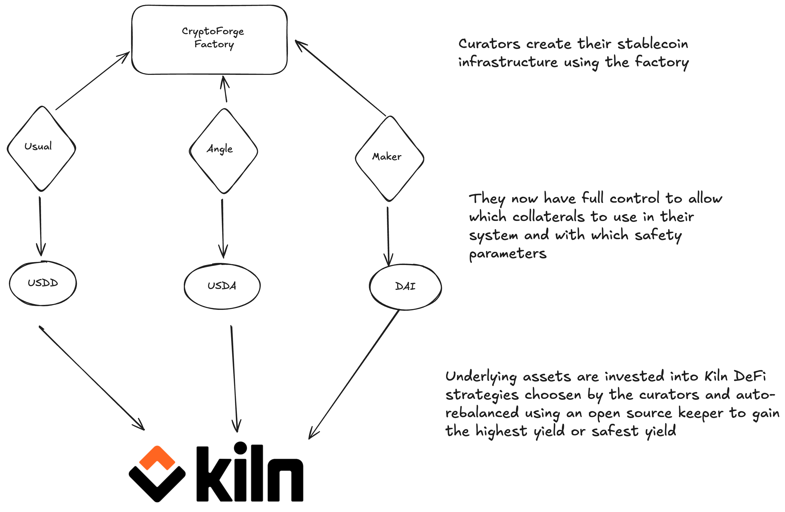

 <h1 align="center"> CryptoForge </h1>

    

    A stablecoin factory.

## Introduction

CryptoForge is CDP factory. It allows "curators" to create their own stablecoin without having to recreate everything themseleves while maintaining ownership and risk managment. It is highly modular to allow for a wide range of use cases.
Recently in DeFi we have seen a rise of CDP protocols such as USUAL, MAKER, BLAST, BERA, Angle. All wanting their own stablecoin so we came up with the idea to provide a whitelabel stablecoin infrastructure for them to use.

## How it works

The flow is as follows:
- A curator interact with the CryptoForge Factory to create a new stablecoin.
- He starts adding collaterals of his choosing with safety parameters such as oracle ot use, maximum allocation, minimum allocation, fees on mint ... to its stablecoin
- He then select Kiln Defi vaults to invest the collterals in with safety parameters such as maximum allocation, minimum allocation, buffer for each collaterals ...
- Finally everything is ready and users can deposit their collaterals to mint the stablecoin as they pleased and withdraw instantly.

## Features

- Peg stability mechanismes
- Multichain by default using LayerZero
- Whitelabel, everyone can deploy their own stablecoin
- Staking contract to redistribue the yield to the stablecoin holders
- Rebalancing mechanism using a keeper to earn the highest / safest yield
- Customizable safety parameters
- Customizable collaterals
- Customizable DeFi vaults
- Customizable fees

## Contracts

- **Factory**: The main factory contract to create a new stablecoin
- **StrategiesRegistry**: The registry of all the kiln strategies available
- **MetaVault**: The vault holding all the collaterals + the strategies to invest them. It is the main vault the curator will interact with to add / remove strategies, rebalance them etc... It is also the receipt token of the stablecoin as an form of an OFT ERC20.
- **Accountant**: The contract in charge of the accounting of the vault. It will calculate the value of the vault and the value of the stablecoin to provide peg stability mechanismes. The curator will interact with this contract to add new collaterals
- **Teller**: The contract in charge of minting / burning the stablecoin. It will interact with the vault to mint / burn the stablecoin and the accountant to get the value of the collateral to mint / burn the stablecoin
- **Staking**: The contract in charge of the staking mechanisme. It will redistribute the yield of the vault to the stablecoin holders using a vesting mechanism as an ERC4626 for maximum composability

